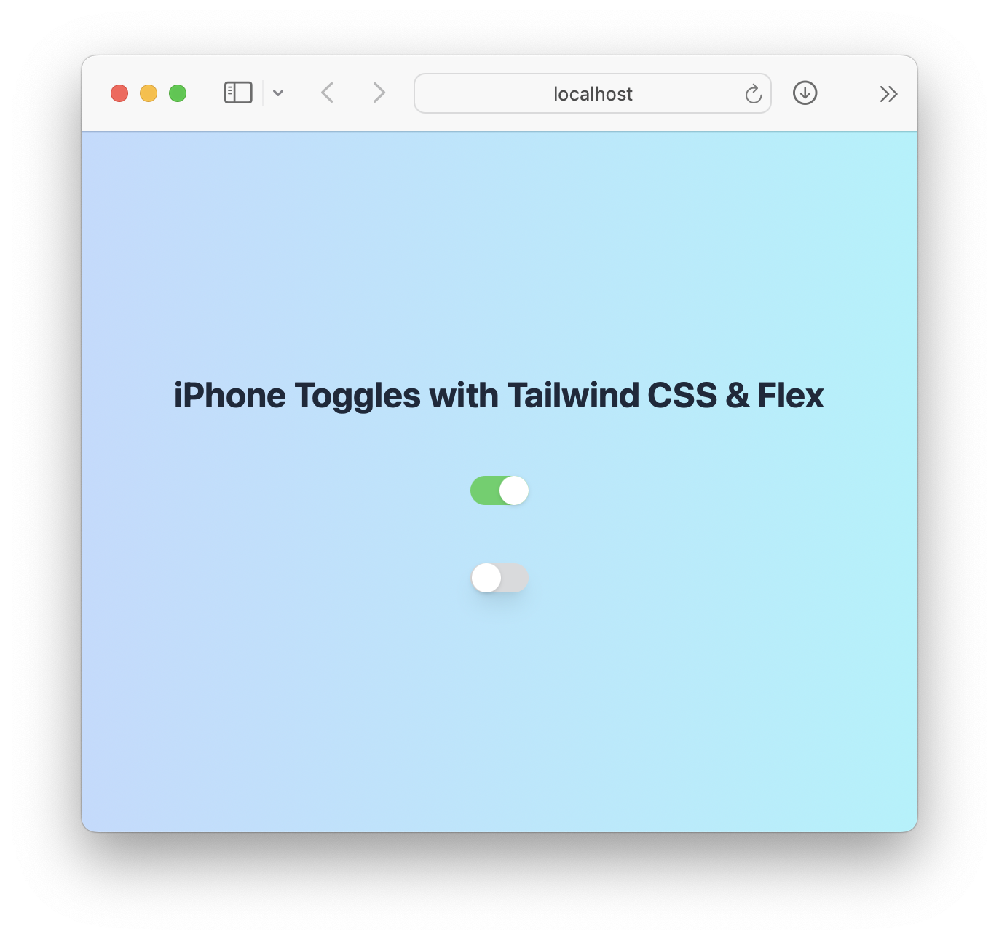

# 📱 Simple iPhone Toggle component with Tailwind CSS, Flex and React

## 📖 Preview

- uses React state to store state (on/off)
- uses Tailwind classes
- uses Flexbox to position toggle – either on start or at the end
- uses standard iPhone colors (green `#4ED164` and gray `#D9DADC`)



## 📦 Component code

```JSX
const Toggle = ({ on = false }) => {
  const [checked, setChecked] = useState(on);
  return (
    <div
      onClick={() => setChecked(!checked)}
      className={classNames(
        'w-10 h-5 rounded-xl flex items-center cursor-pointer',
        checked
          ? 'justify-end bg-[#4ED164]'
          : 'justify-start bg-[#D9DADC] border border-[#D9DADC] shadow-lg'
      )}
    >
      <div className="w-5 h-5 bg-white rounded-full shadow"></div>
    </div>
  );
};
```

## 👨🏼‍💻 Usage example

```JSX
<div className="h-screen w-screen flex flex-col justify-center items-center bg-gradient-to-r from-blue-200 to-cyan-200 gap-10">
  <h1 className="text-2xl font-bold text-slate-800">
    iPhone Toggles with Tailwind CSS & Flex
  </h1>
  <Toggle on />
  <Toggle />
</div>
```

## 🚀 Run locally

This project was bootstrapped with [Create React App](https://github.com/facebook/create-react-app).

### `npm start`

Runs the app in the development mode.\
Open [http://localhost:3000](http://localhost:3000) to view it in your browser.

The page will reload when you make changes.\
You may also see any lint errors in the console.

## 🙏 Credits to Ben Awad (@benawad)

Thanks to Ben Awad (@benawad) I've used nice and fun emodji commit messages. And tagged him as he askes in his video on getting Open-Source fame.
